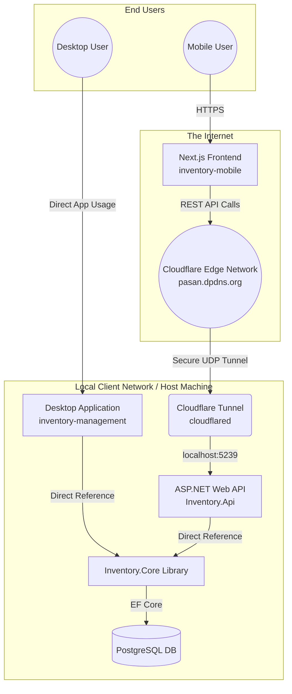

# System Architecture Overview

Welcome to the Inventory Management System repository! This document serves as a high-level guide to understanding how the legacy desktop application, the new mobile API, and the infrastructure connect together.

## 🏗️ High-Level Architecture

The system consists of three main applications that share a core library, all backed by a local PostgreSQL database and securely exposed to the internet via Cloudflare Tunnels.

---

## 📦 Component Breakdown

### 1. `Inventory.Core` (The Brain)
This is a shared C# Class Library that contains all of the shared business logic. Both the Desktop App and the API rely on this so that logic is never duplicated.
- **Data/Entities**: Contains the EF Core Models (`Item`, `Stock`, `UserAccount`, etc.).
- **Data/InventoryDbContext.cs**: The Entity Framework context that connects to Postgres.
- **Services**: All business logic lives here (e.g., `StockService`, `AuthenticationService`, `BarcodeService`).

### 2. `inventory-management` (The Desktop App)
The legacy Windows Desktop application used locally on the client's machine.
- It holds a `<ProjectReference>` to `Inventory.Core`.
- It connects directly to the local database using the connection string defined in its `appsettings.json`.

### 3. `Inventory.Api` (The Backend Bridge)
A lightweight ASP.NET Core Web API that acts as a secure RESTful bridge for the mobile app.
- **Controllers**: Thin wrappers (e.g., `ItemsController`, `StockController`) that receive HTTP requests, parse JSON, and hand the work directly off to the Services in `Inventory.Core`.
- **Authentication**: Implements JSON Web Tokens (JWT). When a user logs in, they receive a signed token which they must attach as a `Bearer` token to all subsequent requests.
- **Windows Service**: Configured via `builder.Host.UseWindowsService()` to run invisibly in the background on the client device.

### 4. `inventory-mobile` (The Frontend)
A modern, mobile-first web application built with **React** and **Next.js**.
- **Deployment**: Deployed completely serverlessly on **Vercel**.
- **Communication**: Uses standard `fetch()` API to talk to the Cloudflare domain. Uses `NEXT_PUBLIC_API_URL` to determine where the API lives.
- **State**: Uses React hooks (`useState`, `useEffect`) and `AbortControllers` to prevent race conditions during rapid user input (like barcode scanning or searching).

### 5. Infrastructure: Cloudflare Tunnels
To allow the Vercel app to talk to the local API without opening highly vulnerable port-forwarding rules on the client's router:
- `cloudflared` runs as a Windows Service on the client machine.
- It creates an outbound-only connection to Cloudflare (`pasan.dpdns.org`).
- Cloudflare acts as a proxy, receiving public internet traffic and funneling it securely into the local `Inventory.Api` running on `localhost:5239`.

---

## 🔒 Security & Secrets Management
> [!IMPORTANT]
> **Never commit secrets to this repository.** The repository is public!

To run the API locally, you must utilize the hidden **.NET User Secrets Vault** for the database credentials and JWT signing keys:

1. Open `Inventory.Api`.
2. Run `dotnet user-secrets init`.
3. Set your local database password:
   `dotnet user-secrets set "ConnectionStrings:InventoryDb" "Host=localhost;Database=inventory_ac_db;Username=postgres;Password=YOUR_PASSWORD"`
4. Set your JWT key:
   `dotnet user-secrets set "Jwt:Key" "A-Long-Secure-String-At-Least-32-Bytes!"`

(The `.env.local` file inside `inventory-mobile` is already git-ignored and safe for storing frontend secrets).
